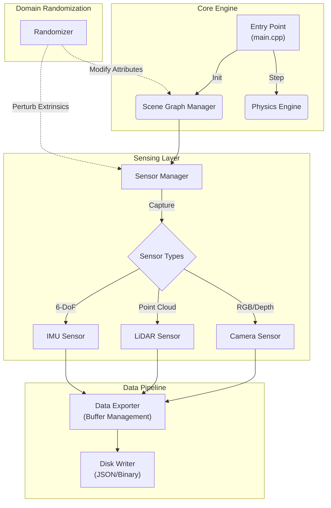

# Isaac Sim Synthetic Data Pipeline (C++ Native)

[](https://opensource.org/licenses/MIT)
[](https://isocpp.org/)
[](https://www.docker.com/)
[](https://developer.nvidia.com/isaac-sim)

> **A high-performance, deterministic synthetic data generation engine aimed at large-scale robotics perception training.**

---

## 📖 Table of Contents
1. [Executive Summary](#-executive-summary)
2. [System Architecture](#-system-architecture)
3. [Technical Deep Dive](#-technical-deep-dive)
    - [USD Scene Composition](#usd-scene-composition)
    - [Sensor Abstraction Layer](#sensor-abstraction-layer)
    - [Domain Randomization Engine](#domain-randomization-engine)
4. [Data Interfaces](#-data-interfaces)
5. [Performance & Scalability](#-performance--scalability)
6. [Getting Started](#-getting-started)
7. [Roadmap](#-roadmap)

---

## 🔭 Executive Summary

The **Isaac Sim Synthetic Data Pipeline** is an industrial-strength solution designed to bridge the "sim-to-real" gap in Physical AI. By leveraging **NVIDIA Omniverse** and the **Universal Scene Description (USD)** framework via C++, this project delivers a highly optimized, headless simulation environment capable of generating millions of labeled frames for perception tasks.

Unlike Python-based scripting wrappers, this C++ native implementation provides:
- **Direct Memory Access**: For high-throughput sensor data transfer.
- **Type Safety**: Reducing runtime errors in large-scale batch jobs.
- **Deterministic Execution**: Guaranteeing bit-exact reproducibility across runs via seeded RNGs.

---

## 🏗 System Architecture

The pipeline operates as a modular graph of C++ systems, orchestrated by a central simulation loop. Each component is decoupled, allowing for hot-swapping of sensor configurations or environment logic without recompilation.



---

## 🔬 Technical Deep Dive

### USD Scene Composition
The `SceneBuilder` module utilizes the `pxr::Usd` C++ API to programmatically compose stages. Instead of loading monolithic assets, it uses **USD References** (`references.add()`) and **Payloads** to assemble scenes dynamically. This allows for:
- **Layering**: Non-destructive overrides for lighting and physics properties.
- **Asset Instancing**: Rendering thousands of objects with minimal VRAM footprint.

### Sensor Abstraction Layer
The `SensorManager` provides a unified interface (`ISensor`) for all perception modalities.
- **Camera**: Supports configurable intrinsics (focal length, aperture), distortion models (Brown-Conrady), and arbitrary resolutions.
- **LiDAR**: Simulates rotating beam patterns with configurable FoV, range, and drop-off rates based on material reflectivity.
- **IMU**: Generates accelerometer and gyroscope data with bias stability and random walk noise modeling.

### Domain Randomization Engine
To prevent neural networks from overfitting to simulation artifacts, the `Randomizer` applies stochastic variations to the scene graph:
- **Visual**: Albedo, Roughness, Metallic, and Emissive texture map shuffling.
- **Lighting**: HDR Map rotation, intensity scaling, and color temperature shifting (3000K-8000K).
- **Kinematic**: Randomizing object poses within physically valid bounds (checking for collisions).

---

## 💾 Data Interfaces

The pipeline exports strict schema-validated data formats compatible with standard MLOps tools.

### Annotation Format (JSON)
Metadata is exported in a hierarchical JSON format, organized per frame.

```json
{
  "frame_id": 1024,
  "timestamp": 16789000.123,
  "sensors": {
    "camera_front": {
      "type": "rgb",
      "path": "rgb/1024.png",
      "intrinsics": [1280, 720, 800.0, 640.0, 360.0]
    },
    "lidar_top": {
      "type": "pointcloud",
      "path": "lidar/1024.pcd",
      "num_points": 45020
    }
  }
}
```

---

## ⚡ Performance & Scalability

- **Headless Mode**: The system is designed to run without a GUI (`./isaac-sim.sh --no-window`), creating a pure compute context suitable for cloud instances (AWS EC2 g4dn, Azure NV series).
- **Docker Containerization**: The provided `Dockerfile` encapsulates all dependencies (USD libs, Python bindings, CUDA drivers), ensuring "write once, run anywhere" capability.
- **Multi-threaded Export**: The `DataExporter` utilizes standard C++ threading to write data to disk asynchronously, preventing I/O blocking from stalling the simulation step.

---

## 🚀 Getting Started

### Prerequisites
- **OS**: Ubuntu 20.04+ (Recommended)
- **Compilers**: GCC 9+ / Clang 10+
- **Build System**: CMake 3.14+
- **Hardware**: NVIDIA RTX GPU (RTX 3060 or higher recommended)

### Build Instructions

```bash
# 1. Clone the repository
git clone https://github.com/aryaMehta26/isaac-sim-synth-data.git
cd isaac-sim-synth-data

# 2. Create build directory
mkdir build && cd build

# 3. Configure and Make provided you have USD libs in path
cmake ..
make -j$(nproc)
```

### Running the Pipeline
```bash
# Run with default configuration
./isaac_synth

# Run with custom config
./isaac_synth --config ../configs/dataset.yaml --frames 5000
```

---

## 🛣 Roadmap

- [ ] **Phase 1**: Core C++ Implementation & Dockerization (Completed)
- [ ] **Phase 2**: Integration with ROS2 bridge for closed-loop control.
- [ ] **Phase 3**: Multi-GPU scaling using `omni.client` for distributed rendering.
- [ ] **Phase 4**: Real-time synthetic-to-real style transfer (CycleGAN integration).

---

## 🧑‍💻 Author

**Arya Mehta**
*M.S. Applied Data Science, San Jose State University*

Specializing in AI Infrastructure, Simulation Systems, and High-Performance Computing.

---
*Copyright © 2026 Arya Mehta. All rights reserved.*
