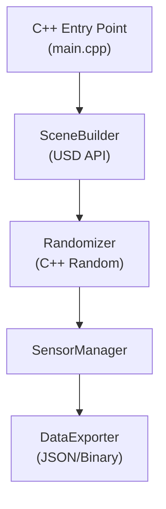

# Isaac Sim Synthetic Data Pipeline (C++ Native)

A production-grade synthetic data generation pipeline built on NVIDIA Omniverse Isaac Sim, now rewritten in **C++** for performance and type safety.
This project leverages the USD C++ API, domain randomization, and physics-aware sensor simulation to generate large-scale labeled datasets.

## 🚀 Features

✔ **C++ Native Core**: High-performance simulation control.
✔ **USD Composition**: Programmatic scene building using USD C++ API.
✔ **Sensor Simulation**: Camera, LiDAR, and IMU abstraction layers.
✔ **Domain Randomization**: Seeded randomization modules.
✔ **Headless Execution**: Deployment via Docker.

## 🏗 System Architecture



## 🛠 Tech Stack

| Component | Technology |
| :--- | :--- |
| **Language** | C++17 |
| **Build System** | CMake |
| **Simulation** | NVIDIA Omniverse Isaac Sim |
| **Scene Format** | USD (Universal Scene Description) |
| **Containerization** | Docker |

## 📁 Repository Structure

```
isaac-sim-synth-data/
├── CMakeLists.txt
├── src/
│   ├── main.cpp
│   ├── SceneBuilder.hpp/cpp
│   ├── SensorManager.hpp/cpp
│   ├── Randomizer.hpp/cpp
│   └── DataExporter.hpp/cpp
├── include/
├── legacy_python/
├── docker/
├── output/
└── configs/
```

## 🚀 Building and Running

### Requirements
- CMake 3.14+
- C++17 Compiler
- NVIDIA Isaac Sim (for USD libraries)

### Build
```bash
mkdir build && cd build
cmake ..
make
```

### Run
```bash
./isaac_synth
```

### Docker
```bash
docker build -t isaac-synth-cpp docker/
docker run --rm -v $(pwd)/output:/workspace/output isaac-synth-cpp
```

## 🧑💻 Author

**Arya Mehta**
M.S. Applied Data Science, San Jose State University
